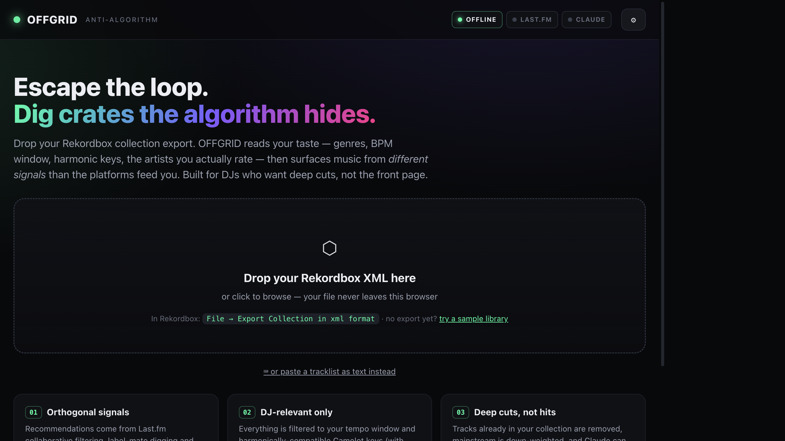

# OFFGRID — Anti-Algorithm Crate Digging for DJs

[](https://github.com/sourenahashemi-crypto/OFFGRID/actions/workflows/pages.yml)

Drop your **Rekordbox collection export** and OFFGRID builds a taste profile (genres, tempo
window, harmonic keys, top artists/labels), then surfaces music from **different signals** than
the platforms feed you — so you escape the algorithmic loop and find real deep cuts that are
actually mixable.

Everything runs **100% in your browser**. There is no backend. Your library and your API keys
never leave your machine.




Live demo: https://sourenahashemi-crypto.github.io/OFFGRID/
GitHub Pages: live and deployed from `main`.

## Repository

This repository is already set up for GitHub Pages and publishes from `main`.

If you want to fork or recreate it, the shortest path is still:

1. Keep `index.html` as the app entry point, plus the support files in this repo.
2. Use the existing workflow in `.github/workflows/pages.yml` as the Pages deploy path.

Recommended repo files now included:

- `.gitignore` for local OS/editor noise.
- `LICENSE` for clear reuse terms.
- `CONTRIBUTING.md` for issue and PR hygiene.
- `SECURITY.md` for reporting API-key or browser-storage concerns.
- `.github/workflows/pages.yml` for automatic GitHub Pages deployment.

---

## Quick start

### Option A — full features (recommended)
Some services (Last.fm, the Claude API) refuse requests from a `file://` page. Serve the folder
over a tiny local server instead:

```bash
cd "Dj ALgoritm"
python3 -m http.server 8000
```

Then open **http://localhost:8000** in your browser.

> No Python? Any static server works, e.g. `npx serve` or the VS Code "Live Server" extension.

### Option B — just analysis
Double-click `index.html`. Taste analysis and smart search links work offline. API-powered
discovery may be blocked by browser security on `file://` (the app shows a banner if so).

### No Rekordbox export yet?
Click **"try a sample library"** on the upload screen to explore with a built-in demo collection.

To make your own export in Rekordbox: **File → Export Collection in xml format**.

---

## The three tiers

| Tier | Needs | What you get |
|------|-------|--------------|
| **Free / no key** | nothing | Full taste analysis (genre fingerprint, tempo histogram, Camelot wheel, top artists/labels) **+ real ListenBrainz + MusicBrainz collaborative-filtering recommendations**, plus smart YouTube/Beatport/Bandcamp starting-point links. |
| **+ Last.fm** | free API key | Adds Last.fm collaborative-filtering discovery: tracks/artists "people who like X also play", plus adjacent-genre top tracks, with match scores. Filtered to your tempo window and harmonic keys. |
| **+ AI engine** | a provider key (Gemini/Groq/OpenRouter/Mistral free, or paid Claude) | The AI **infers your style from the seed tracks**, then re-ranks the pool to stay strictly in-lane, estimates **BPM + Camelot key** per pick, adds in-style lateral deep cuts, and writes a one-line "why it fits" reason. Pick the provider in **⚙ Settings**. |

Add keys in **⚙ Settings**. They are stored only in this browser's `localStorage` and sent
directly to each service.

### Keys are optional — discovery works with zero keys
**ListenBrainz + MusicBrainz** collaborative filtering needs **no key at all** and is on by default,
so OFFGRID surfaces real, orthogonal recommendations the moment you load a library. The keys below
just add more signals:
- **Last.fm API key** — https://www.last.fm/api/account/create (paste the *API key*, not the secret). No OAuth needed for the reads this app makes.
- **AI engine** *(pick one in Settings)* — the AI stage infers your style from the seed tracks, then ranks + explains the picks. **Choose your provider** — most have a free tier, all are called directly from the browser:
  - **Google Gemini** — https://aistudio.google.com/apikey · *free tier*
  - **Groq** — https://console.groq.com/keys · *free, very fast*
  - **OpenRouter** — https://openrouter.ai/keys · *free models (`:free`)*
  - **Mistral** — https://console.mistral.ai/api-keys · *free tier*
  - **Anthropic Claude** — https://console.anthropic.com/settings/keys · *paid, deepest reasoning*
- **Discogs token** *(optional)* — at https://www.discogs.com/settings/developers click **"Generate token"** and paste the **personal access token** (a ~40-char string), **not** an app's consumer key/secret. Unlocks label-mate digging (other artists on labels you rate).

---

## How the "anti-algorithm" works

Engagement-optimised feeds reinforce what you already play. OFFGRID deliberately pulls from
**orthogonal signals**:

1. **Cross-platform collaborative filtering** (Last.fm) — built on different data than video feeds.
2. **ListenBrainz + MusicBrainz collaborative filtering** (free, **no key**) — MetaBrainz open-data
   "fans of artist X also play Y", an independent CF signal. Your top artists are resolved to
   MusicBrainz IDs, ListenBrainz returns similar artists, and each one's top recordings become
   real, mixable candidates. A **genre-tag style gate** first learns your lane from your seeds'
   genre tags, then drops any similar-artist track whose genre doesn't match — so a techno seed
   never drifts into that artist's mainstream rock hit. Works with zero keys.
3. **Label-mate digging** (Discogs, optional) — other artists on labels you rate.
4. **Adjacent-subgenre exploration** — one curated step sideways from your core genres.
5. **Style-locked AI picks** (your chosen engine) — the AI infers your exact sub-genre/tempo from the seeds and adds in-lane tastemaker deep cuts that pure similarity graphs miss, while rejecting off-style or mainstream candidates.

Then it filters for DJs: only your **tempo window** (with ½ / ×2 matching) and
**harmonically-compatible Camelot keys** survive, and anything already in your crate is dropped.

Finally, the surviving picks are **diversity-re-ranked**. Rather than a pure relevance sort —
which lets one artist, label or sub-genre flood the list — OFFGRID uses MMR ("maximal marginal
relevance") declustering: each pick is chosen to balance its own fit against how similar it
already is to what's been selected. Recommender-systems research shows this buys a large jump in
list diversity for a tiny relevance cost, and the serendipity literature is clear that deep cuts
help *only when they stay relevant* ("unexpected-yet-relevant"), so the relevance floor is kept.
The **Variety** slider controls how aggressively the crate is spread, and a **crate-spread**
readout (distinct artists / sub-genres / sources + a balance score) shows the result.

---

## Audio previews (opt-in)
Every recommendation links out to YouTube, Beatport, Bandcamp, SoundCloud and Last.fm. You can
also play a **30-second preview in-app**: enable *Audio previews* in **⚙ Settings** (off by
default) and a ▷ button appears on each pick and on your saved crate. Previews use Apple's public
**iTunes Search API** — no key required. This is the one feature that sends a track title off your
machine, which is why it is opt-in and clearly labelled; everything else stays local. If a track
has no Apple match the preview falls back silently to the search links.

## Privacy & notes
- The XML is parsed in-browser with `DOMParser`; it is never uploaded.
- Audio previews are **off by default**. When you turn them on, only the track title is sent to
  Apple's iTunes Search API to fetch a preview clip; your library, ratings and keys never leave
  the browser.
- Rekordbox ratings are stored as 0/51/.../255 — OFFGRID converts to 0–5 stars. Keys are
  normalised from classical **or** Camelot notation to the Camelot wheel.
- The **Label** field is frequently empty in exports — Discogs enrichment can recover it.
- Claude can occasionally hallucinate a track name; OFFGRID grounds it against the real Last.fm
  candidate pool and presents every action as a *search* you verify before trusting.
- Spotify's recommendation/audio-feature endpoints were deprecated for new apps (Nov 2024) and
  Beatport's API is closed to individuals — that's why discovery uses Last.fm, ListenBrainz and
  smart links, by design. (Deezer was evaluated but blocks browser requests via CORS.)
- The free **ListenBrainz / MusicBrainz** lookups send only artist names (and MusicBrainz IDs) to
  MetaBrainz's open APIs to fetch collaborative-filtering recommendations; no key, and your library
  never leaves the browser. Results are cached locally so re-runs cost no calls.

---

## Files
- `index.html` — the entire app (HTML + CSS + JS, no build step, no dependencies).
- `README.md` — this file.

## Suggested next steps

1. Split `index.html` into `styles.css` and `app.js` if you want the codebase to grow.
2. Swap the cover SVG for a real screenshot or a short GIF when you have one.
3. Keep shipping improvements behind the same GitHub Pages URL so the demo stays current.
