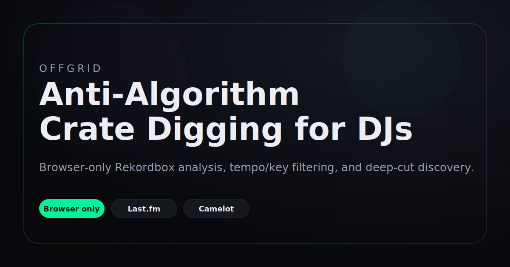

# OFFGRID — Anti-Algorithm Crate Digging for DJs

Drop your **Rekordbox collection export** and OFFGRID builds a taste profile (genres, tempo
window, harmonic keys, top artists/labels), then surfaces music from **different signals** than
the platforms feed you — so you escape the algorithmic loop and find real deep cuts that are
actually mixable.

Everything runs **100% in your browser**. There is no backend. Your library and your API keys
never leave your machine.



Live demo: https://sourenahashemi-crypto.github.io/OFFGRID/

## GitHub-ready setup

If you are publishing this as a new repository, the shortest path is:

1. Create a new GitHub repo named `offgrid` or similar.
2. Initialize this folder as git, connect the remote, and push `main`.
3. Keep `index.html` as the app entry point, plus the support files in this repo.
4. Add a screenshot or short GIF to the README once you have a stable release.

Recommended repo files now included:

- `.gitignore` for local OS/editor noise.
- `LICENSE` for clear reuse terms.
- `CONTRIBUTING.md` for issue and PR hygiene.
- `SECURITY.md` for reporting API-key or browser-storage concerns.
- `.github/workflows/pages.yml` for automatic GitHub Pages deployment.

## GitHub Pages note

The Pages workflow can only create the site automatically if you add a repository secret named `PAGES_TOKEN`.

Use a personal access token with the `repo` scope or Pages write permission, then add it in:

`Settings → Secrets and variables → Actions → New repository secret`

Without that secret, GitHub Pages creation falls back to a 404 from the API and the workflow fails.

---

## Quick start

### Option A — full features (recommended)
Some services (Last.fm, the Claude API) refuse requests from a `file://` page. Serve the folder
over a tiny local server instead:

```bash
cd "Dj ALgoritm"
python3 -m http.server 8000
```

Then open **http://localhost:8000** in your browser.

> No Python? Any static server works, e.g. `npx serve` or the VS Code "Live Server" extension.

### Option B — just analysis
Double-click `index.html`. Taste analysis and smart search links work offline. API-powered
discovery may be blocked by browser security on `file://` (the app shows a banner if so).

### No Rekordbox export yet?
Click **"try a sample library"** on the upload screen to explore with a built-in demo collection.

To make your own export in Rekordbox: **File → Export Collection in xml format**.

---

## The three tiers

| Tier | Needs | What you get |
|------|-------|--------------|
| **Offline** | nothing | Full taste analysis (genre fingerprint, tempo histogram, Camelot wheel, top artists/labels) + smart YouTube/Beatport starting-point links for adjacent genres and similar-artist digging. |
| **+ Last.fm** | free API key | Real collaborative-filtering discovery: tracks/artists "people who like X also play", plus adjacent-genre top tracks, with match scores. Filtered to your tempo window and harmonic keys. |
| **+ Anthropic** | API key | Claude re-ranks the candidate pool, estimates **BPM + Camelot key** for each pick, adds lateral deep cuts that pure similarity misses, and writes a one-line "why you'll like this" reason per track. |

Add keys in **⚙ Settings**. They are stored only in this browser's `localStorage` and sent
directly to each service.

### Getting keys (both free to create)
- **Last.fm API key** — https://www.last.fm/api/account/create (paste the *API key*, not the secret). No OAuth needed for the reads this app makes.
- **Anthropic API key** — https://console.anthropic.com/settings/keys . Calls use the official `anthropic-dangerous-direct-browser-access` browser header. A full discovery run costs a fraction of a cent.
- **Discogs token** *(optional)* — https://www.discogs.com/settings/developers . Unlocks label-mate digging (other artists on labels you rate).

---

## How the "anti-algorithm" works

Engagement-optimised feeds reinforce what you already play. OFFGRID deliberately pulls from
**orthogonal signals**:

1. **Cross-platform collaborative filtering** (Last.fm) — built on different data than video feeds.
2. **Label-mate digging** (Discogs, optional) — other artists on labels you rate.
3. **Adjacent-subgenre exploration** — one curated step sideways from your core genres.
4. **Lateral picks** (Claude) — tastemaker deep cuts that similarity graphs miss.

Then it filters for DJs: only your **tempo window** (with ½ / ×2 matching) and
**harmonically-compatible Camelot keys** survive, and anything already in your crate is dropped.

---

## Privacy & notes
- The XML is parsed in-browser with `DOMParser`; it is never uploaded.
- Rekordbox ratings are stored as 0/51/.../255 — OFFGRID converts to 0–5 stars. Keys are
  normalised from classical **or** Camelot notation to the Camelot wheel.
- The **Label** field is frequently empty in exports — Discogs enrichment can recover it.
- Claude can occasionally hallucinate a track name; OFFGRID grounds it against the real Last.fm
  candidate pool and presents every action as a *search* you verify before trusting.
- Spotify's recommendation/audio-feature endpoints were deprecated for new apps (Nov 2024) and
  Beatport's API is closed to individuals — that's why discovery uses Last.fm + links, by design.

---

## Files
- `index.html` — the entire app (HTML + CSS + JS, no build step, no dependencies).
- `README.md` — this file.

## Suggested next steps

1. Split `index.html` into `styles.css` and `app.js` if you want the codebase to grow.
2. Swap the cover SVG for a real screenshot or a short GIF when you have one.
3. Keep shipping improvements behind the same GitHub Pages URL so the demo stays current.
